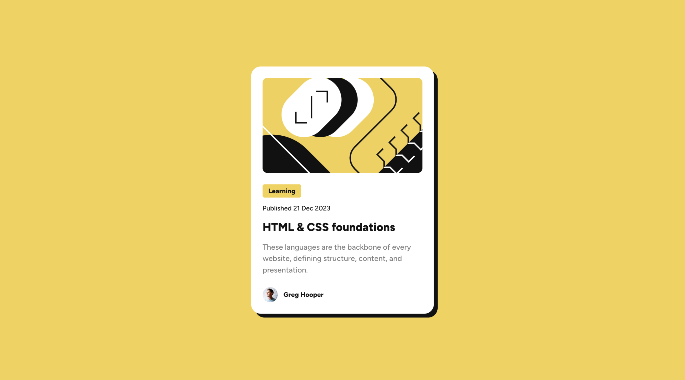
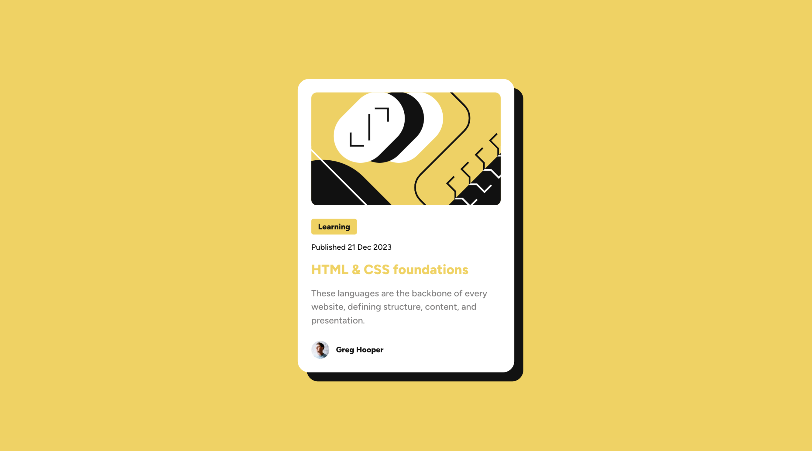
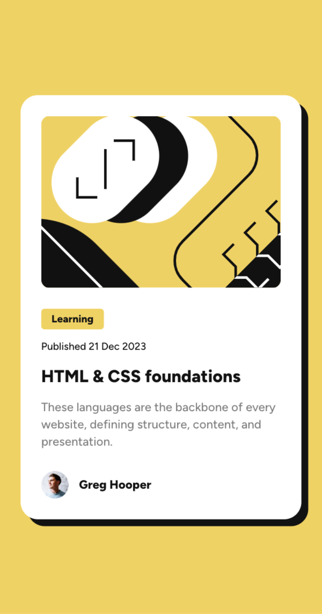
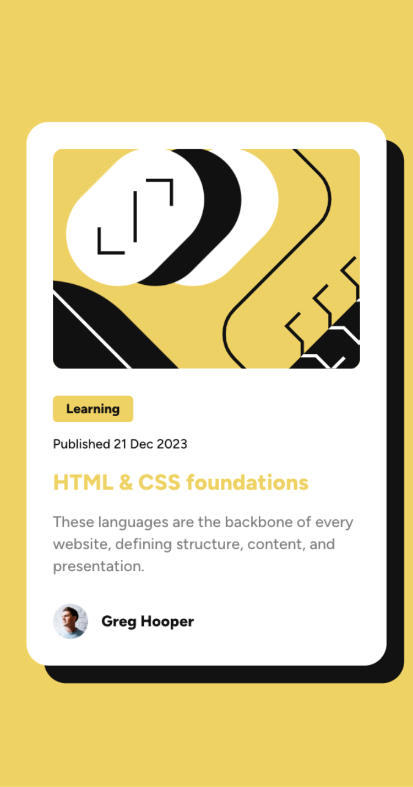

# Frontend Mentor - Blog preview card solution

This is a solution to the [Blog preview card challenge on Frontend Mentor](https://www.frontendmentor.io/challenges/blog-preview-card-ckPaj01IcS).

## Table of contents

- [Overview](#overview)
  - [The challenge](#the-challenge)
  - [Screenshot](#screenshot)
  - [Links](#links)
- [My process](#my-process)
  - [Built with](#built-with)
  - [Useful resources](#useful-resources)
- [Author](#author)

## Overview

### The challenge

Users should be able to:

- See hover and focus states for all interactive elements on the page

### Screenshot

| Desktop Preview                           | Desktop Preview - Active                         |
| ----------------------------------------- | ------------------------------------------------ |
|  |  |

| Mobile Preview                           | Mobile Preview - Active                         |
| ---------------------------------------- | ----------------------------------------------- |
|  |  |

### Links

- Solution URL: [Frontend Mentor Page](https://www.frontendmentor.io/solutions/blog-preview-card-MgSyXNTw_b)
- Live Site URL: [Deployed on Vercel](https://fm-2024-blog-preview-card.vercel.app)

## My process

### Built with

- Semantic HTML5 markup
- CSS custom properties
- Flexbox
- Mobile-first workflow
- [React](https://reactjs.org/) - JS library
- [Next.js](https://nextjs.org/) - React framework
- [Tailwind CSS](https://tailwindcss.com/) - For styles

### Useful resources

- [Styling based on descendants - TailwindCSS Docs](https://tailwindcss.com/docs/hover-focus-and-other-states#styling-based-on-descendants)

## Author

- Twitter - [@ardaekereu](https://www.twitter.com/ardaekereu)
- Frontend Mentor - [@ardaeker](https://www.frontendmentor.io/profile/ardaeker)
